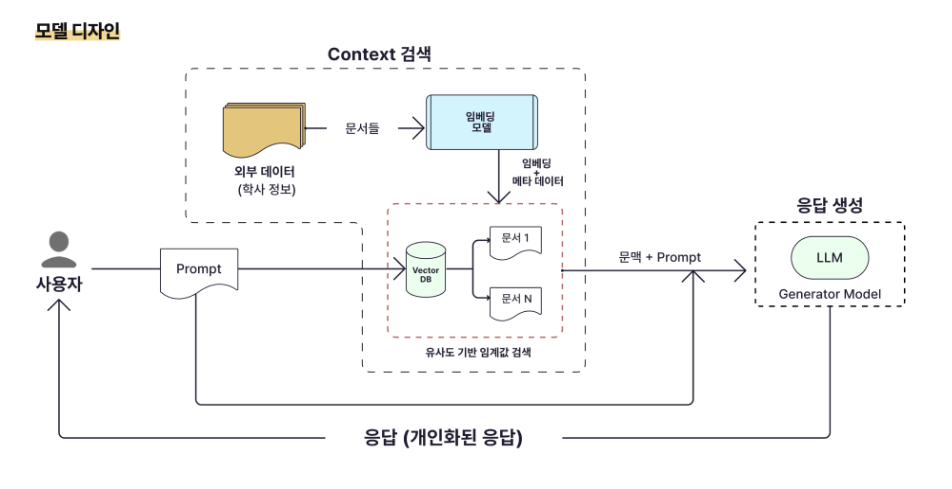

# Future CV *(가상 이력서)*

> ⚠️ 이 문서는 **가상의 미래 이력서**입니다. 실제 정보와 다를 수 있습니다.

---

## 김현진

### AI 엔지니어  |  깃허브 : [https://github.com/peng1204](https://github.com/peng1204)

사용자 경험(UX) 중심 ***AI 엔지니어*** 김현진입니다.  
RAG 기반 챗봇, 실시간 객체 탐지, 데이터 크롤링 프로젝트를 통해 비정형 데이터를 구조화하고, 사용자 의사결정을 지원하는 AI 서비스를 설계·배포한 경험이 있습니다.  
**Python, Java**를 중심으로, 단순 모델 개발을 넘어 사용자 경험과 신뢰도를 동시에 개선하는 데에 관심을 가지고 있습니다.

| 항목 | 내용 |
|:-----|:-----|
| **이름** | 김현진 |
| **이메일** | [stellahkim@naver.com](mailto:stellahkim@naver.com) |
| **GitHub** | [https://github.com/peng1204](https://github.com/peng1204) |

---

## 교육

#### 1. 광운대학교 경영학과 (복수전공 : 정보융합학과) | 21.03 ~ 26.08

- 개발에 필요한 기초 CS 지식 습득

#### 2. GIST (광주과학기술원) 기술경영전문대학원 — 기술경영학 석사 | 26.09 ~ 28.08

- AI 기반 비즈니스 혁신 / 기술 사업화 전략
- 석사 과정 중 **스타트업 창업** 준비 병행

#### 3. 네이버 부스트캠프 AI Tech 8기 | 23.09~24.08

- 머신러닝·딥러닝 모델링과 데이터 전처리 및 성능 개선 기법 학습
- 고객의 입장에서 기능을 개발하며, 기획부터 개발까지 모든 과정을 담당함

#### 4. KTAIVLE SCHOOL 9기 AI트랙 | 26.03 ~ 26.08

- 실무 중심 AI 서비스 개발 프로세스 및 End-to-End 시스템 설계 학습
- AI 기반 서비스 개발 프로젝트에서 데이터 처리 및 백엔드 로직 구현 담당

---

## 경력

#### 1. [PTKOREA] 인턴 — *대기업 글로벌 브랜드 VoC Monitoring 및 데이터 분석 지원* | 24.06 ~ 24.09

#### 2. [인터엑스] — *PO(Product Owner)-AI* | 24.10 ~ 25.02

#### 3. [카카오] 인턴 — *LLM Research Engineer Intern* | 26.03 ~ 26.06

---

## 프로젝트

> ### 1. KW-VIZER

|  |  |
|---|---|
| **📄한 줄 소개** | 학사 데이터를 기반으로 질의응답을 제공하는 RAG 기반 AI 진로상담 챗봇 |
| **📆진행 기간** | 2024.03 ~ 2024.06 |
| **🤖백엔드 사용 기술** | `Python`, `FastAPI`, `LangChain` |
| **⚙️인프라 사용 기술** | `ChromaDB`, `HuggingFace Embedding`, `FAISS` |
| **💻주요 역할 및 담당** | PM, RetrievalQA 기반 응답 생성 로직 구현 |
| **🏆성과** | 사용자 테스트 결과, 정보 탐색 시간 약 90% 단축 |

- 🔗 [시연 영상](https://youtu.be/k_DE1ixZD6I) | [깃허브 링크](https://github.com/peng1204/kw_vizer)

기존 학사 정보 시스템은 키워드 기반 검색 방식으로 인해 **사용자가 원하는 정보를 정확하게 찾기 어렵고, 문맥을 이해하지 못하는 한계**가 있었습니다. 이를 해결하기 위해 **RAG 기반 질의응답 시스템**을 구축하여, 비정형 학사 데이터를 벡터화하고 문맥 기반으로 검색 및 응답을 생성하는 방식을 적용했습니다. 이 문제를 해결하는 것을 목표로 학사 데이터를 기반으로 한 **AI 진로상담 챗봇**을 개발했습니다.

### 해당 프로젝트에서 담당한 역할
---
#### ***LangChain 기반 RAG 질의응답 시스템 구현 담당***

⚠️ **기존 키워드 검색 방식 : 문맥 이해 불가능 -> 정확도 및 사용자 만족도 낮음**

✅ **JSON/PDF 데이터 임베딩 후, Chroma DB에 저장 / RetrievalQA 구조 적용해 문맥 기반 검색 및 응답 생성으로 개선**

- **RAG 기반 질의응답 시스템 설계 및 구현**

    - LangChain 기반 RetrievalQA 체인 구성하여 질의 → 검색 → 응답 생성 흐름 구축  
    - ChromaDB 기반 벡터 DB 설계 및 컬렉션 구조 분리하여 검색 효율 개선

- **검색 성능 개선 및 구조 최적화**

    - 컬렉션 분리(lecture / career / academic) 통해 도메인별 검색 정확도 확보  
    - Retrieval 결과 기반 prompt 구성하여 응답 일관성 확보

---

> ### 2. WE-CHU

|  |  |
|---|---|
| **📄한 줄 소개** | 사용자 경험 기반으로 학사·진로 의사결정을 지원하는 RAG 기반 AI 진로상담 챗봇 |
| **📆진행 기간** | 2024.07 ~ 2024.11 |
| **🤖백엔드 사용 기술** | `Python`, `FastAPI`, `LangChain` |
| **⚙️인프라 사용 기술** | `FAISS`, `HuggingFace Embedding`, `HyperCLOVA X` |
| **💻주요 역할 및 담당** | PM, 사용자 경험 기반 AI 상담 챗봇 설계 및 UX/UI 개선 |
| **🏆성과** | FAQ 대비 사용자 만족도 약 1.8배 향상 |

- 🔗 [깃허브 링크](https://github.com/peng1204/wechu)

KW-VIZER에서 RAG 기반 질의응답 시스템을 구축했지만, 실제 사용 과정에서 사용자가 자신의 상황에 맞는 정보를 이해하고 의사결정을 내리기에는 한계가 있다는 문제를 발견했습니다. 특히 단순 정보 제공 방식은 사용자 만족도가 낮고, **감정적 공감이나 상황 맞춤형 응답**이 부족했습니다. 이를 해결하기 위해 **사용자 경험을 중심으로 챗봇을 재설계**하고, 실제 **사용자 설문과 A/B 테스트**를 통해 응답 구조와 인터페이스를 개선하는 방향으로 **WEcHU** 프로젝트를 진행했습니다.

### 해당 프로젝트에서 담당한 역할
---
#### ***UX 기반 실험 설계 및 프롬프트 설계 구현 담당***

⚠️ **단순 정보 전달 중심 응답으로 사용자 만족도 및 몰입도 낮은 문제 존재**

✅ **공감 → 상황 파악 → 해결 제안 흐름의 응답 구조 설계, 단계형 답변 포맷 적용하여 이해도 및 사용자 경험 개선**  
✅ **A/B 테스트 설계 및 사전/사후 설문 구조 구축**

- **UX 기반 실험 설계 및 사용자 검증**

    - 챗봇 vs FAQ 비교 위한 **A/B 테스트** 구조 설계 및 적용 수행  
    - DCS, BUS-11, NPS 지표 적용하여 사용자 경험 정량 평가 수행
    - 실험 결과 기반으로 UX 개선 방향 도출 및 서비스 반영

- **공감형 프롬프트 설계 및 응답 구조 구현**

    - 초기 응답에서 공감 및 추가 질문 유도하도록 프롬프트 제어 로직 구현
    - 단계형 답변 포맷 적용하여 정보 구조화 및 이해도 개선

- **UI/UX 구조 개선 및 인터페이스 설계**

    - 사용자 피드백 기반으로 UI 흐름 단순화 및 페이지 레이아웃 재설계
    - 핵심 정보 강조를 위한 **들여쓰기 및 단계형 구성** 적용
    - **이모티콘을 활용한 시각적 구분 요소 추가**하여 정보 인지 속도 개선

---

## 기술 스택

| 구분 | 기술 | 숙련도 |
| :--- | :---: | ---: |
| **Language** | Python, Java, SQL | ⭐⭐⭐⭐⭐ |
| **AI / ML** | PyTorch, TensorFlow, LangChain | ⭐⭐⭐⭐ |
| **Backend** | FastAPI, Spring Boot | ⭐⭐⭐⭐ |
| **DevOps** | Docker, GitHub Actions | ⭐⭐⭐ |
| **DB** | MySQL, MongoDB, BigQuery | ⭐⭐⭐ |

---

## 자격증

| 자격증 | 발급 기관 | 취득일 |
|--------|----------|--------|
| **정보처리기사** | 한국산업인력공단 | 2024.06 |
| **빅데이터분석기사** | 한국데이터산업진흥원 | 2024.09 |
| **ADsP** | 한국데이터산업진흥원 | 2024.11 |
| **AICE Associate** | KT | 2025.08 |
| **OPIc IH** | ACTFL | 2026.02 |
| **HSK 5급** | HSK한국사무국 | 2024.11 |
| **HSK 6급** | HSK한국사무국 | 2026.03 |

---

## 수상기록

| 상명 | 주최 기관 | 수상일 |
|--------|----------|--------|
| **대한인간공학회 캡스톤디자인 경진대회 장려상** | 대한인간공학회 | 2025.11 |
| **지능형로봇 컨소시엄 창의적 종합설계 경진대회 장려상** | 지능형로봇혁신융합대학사업단 | 2025.08 |
| **산학연계 SW 프로젝트 전시회 장려상** | 광운대학교 | 2025.06 |
| **졸업작품 전시회 우수상** | 광운대학교 | 2025.11 |
| **K-디지털 트레이닝 해커톤 우수상** | 고용노동부 | 2026.02 |
| **HSK speaking contest 장려상** | 주한중국대사관 | 2024.11 |

---

## 추천인

본 이력서의 추천인으로 아래 교수님을 기재합니다.

**박규동 교수님 (Dr. Kyudong Park)**  
School of Information Convergence (정보융합학부), 광운대학교 (KwangWoon University)  

---
 이 문서는 가상의 미래 이력서입니다. 실제 정보와 다를 수 있습니다. 